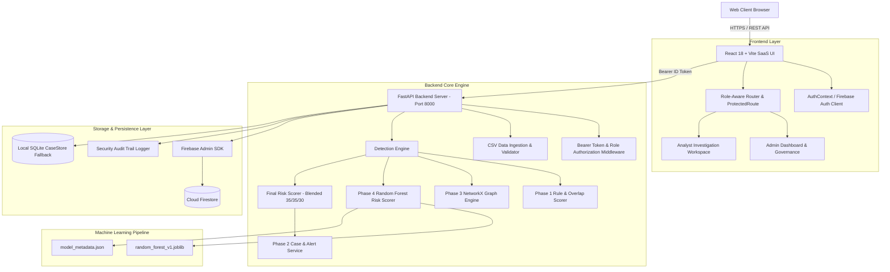

# RazorGuard

**AI-powered merchant-customer collusion and payment fraud detection platform.**

RazorGuard analyzes transaction behavior, merchant-customer relationships, shared identity fingerprints (device IDs, IP addresses, payment instruments), refund velocity, and multi-entity risk signals to uncover coordinated fraud rings and streamline investigation workflows for financial safety teams.


---

## Project Links

- **Live Demo**: Coming soon / Not currently deployed
- **GitHub Repository**: [RazorGuard AI Repository](https://github.com/pranaykhodade1922-dot/RazorGuard-AI-Merchant-Customer-Collusion-Detector)
- **Interactive API Documentation**: `http://127.0.0.1:8000/docs` (when backend is running)

---

## Problem Statement

Traditional payment fraud detection systems analyze transactions individually against static threshold rules (e.g., maximum transaction amount or single-account velocity). Modern fraud syndicates—especially **merchant-customer collusion rings**, **cashout syndicates**, and **systematic refund abuse**—easily evade single-entity monitoring by:

1. **Splitting Collusion across Entities**: Distributing high-value fraudulent payouts across multiple customer accounts connected to complicit merchant storefronts.
2. **Identity Obfuscation**: Sharing physical hardware device fingerprints, IP subnets, and UPI payout handles across supposedly unrelated customer profiles.
3. **Threshold Avoidance**: Structuring transaction amounts below traditional high-risk review limits while generating high refund ratios.

Manual investigation of complex multi-entity networks without automated relationship visualization is slow, prone to false negatives, and unable to scale with enterprise payment volumes.

---

## Solution

RazorGuard addresses coordinated payment fraud by combining rule-based risk indicators, topological graph analysis, machine learning risk scoring, and role-differentiated investigation workflows:

```text
       Raw Transaction & Entity Data
                     │
                     ▼
           Data Ingestion Pipeline
        (CSV Import / Schema Validator)
                     │
                     ▼
             Detection Engine
     ┌───────────────┼───────────────┐
     ▼               ▼               ▼
Rule & Overlap   Network Graph   ML Scorer
   Scorer        Topology Engine (22 Features)
 (Phase 1)         (Phase 3)      (Phase 4)
     │               │               │
     └───────────────┼───────────────┘
                     ▼
         Blended Final Risk Score
  (35% Rule + 35% Graph + 30% ML Score)
                     │
                     ▼
         Risk Prioritization Engine
                     │
          ┌──────────┴──────────┐
          ▼                     ▼
   Priority Alerts      Investigation Cases
          │                     │
          └──────────┬──────────┘
                     ▼
      Role-Differentiated SaaS Workspaces
         (ADMIN / ANALYST Navigation)
```

---

## Key Features

### 🔍 Fraud Detection & Scoring Engine
- **Triple-Model Blended Risk Score**: Combines Transaction Overlap Signals (35%), Graph Topology Metrics (35%), and Machine Learning Random Forest Predictions (30%).
- **Explainable Risk Intelligence**: Every score breakdown details exact feature contributions, rule indicators, and human-readable reasoning.
- **Risk Classification**: Automatically categorizes entities into `LOW` (0–29), `MEDIUM` (30–59), `HIGH` (60–79), and `CRITICAL` (80–100) risk bands.

### 🕸️ Graph Network Intelligence
- **Entity Relationship Mapping**: Constructs a multi-graph mapping connections between Merchants, Customers, Devices, IPs, and UPI Accounts.
- **Collusion Pattern Recognition**: Detects circular payment loops, shared identity clusters, and dense merchant-customer subgraphs.
- **Interactive SVG Graph Visualizer**: Built-in visualizer with pan, zoom, node filtering, risk threshold sliders, shortest path calculation, and drawer inspection.

### 📋 Enterprise Investigation & Case Management
- **Automated Case Generation**: Idempotently generates investigation cases for high-risk entities.
- **Case State Machine**: Supports lifecycle states (`NEW`, `UNDER_REVIEW`, `CONFIRMED_FRAUD`, `FALSE_POSITIVE`, `CLOSED`).
- **Investigator Audit Logging**: Timed investigator activity feed tracking status updates and notes.
- **Priority Alerts Feed**: Live feed filtering active threats by severity (`CRITICAL`, `HIGH`, `MEDIUM`).

### 📥 CSV Data Ingestion Pipeline
- **Drag-and-Drop Uploader**: Ingest custom CSV datasets for `Transactions`, `Merchants`, and `Customers`.
- **Validation & Normalization**: Performs header checking, type validation, required field verification, and duplicate ID filtering before detection execution.

### 🛡️ Authentication & Role-Based Access Control (RBAC)
- **Firebase Authentication Integration**: Secure identity verification using Firebase Auth with bearer token backend verification.
- **Role Separation**: Dedicated, tailored user experiences for `ADMIN` and `ANALYST` roles.
- **Server-Side API Enforcement**: Role-protected backend dependencies (`require_admin`) restricting administrative operations.
- **Security Audit Logs**: Stream recording user sign-ins, dataset imports, case state modifications, and admin actions.

---

## User Roles & Access Control

RazorGuard enforces strict role-based separation between platform governance and threat investigation:

```text
                            Authenticated User
                                    │
                                    ▼
                          Firebase Role Verification
                                    │
           ┌────────────────────────┴────────────────────────┐
           ▼                                                 ▼
      ADMIN Role                                       ANALYST Role
Platform & System Management                       Fraud Investigation Workspace
           │                                                 │
 ├── System Health & Overview                        ├── Fraud Investigation Workspace
 ├── Data Ingestion Pipeline (`/ingest`)              ├── Open Cases Queue (`/cases`)
 ├── Security Audit Trail Logs (`/audit`)            ├── Priority Risk Alerts (`/alerts`)
 └── System Configuration (`/settings`)              ├── Transaction Inspection (`/transactions`)
                                                     ├── Merchant & Customer Directories
                                                     └── Network Graph Visualizer (`/network`)
```

### 🔐 ADMIN (Platform & System Governance)
- **Platform Overview**: Global counters for system-wide volume, total merchants/customers, system cases, and total fraud exposure.
- **Dataset Ingestion**: Access to batch CSV uploader (`/ingest`) to feed new entity and transaction records into the detection engine.
- **Security Audit Logs**: Real-time audit trail view (`/audit`) recording security events, authentication logs, and data operations.
- **System Settings**: Platform health oversight and security configuration settings (`/settings`).

### 🕵️ ANALYST (Fraud Investigation Workspace)
- **Investigation Workspace**: Action-oriented dashboard highlighting active high-risk queues, priority alerts, and suspicious merchant hotspots.
- **Case Management**: Full case lifecycle control (`/cases`), investigator notes, and case status transitions.
- **Threat Intelligence**: Access to entity investigation workspaces (`/merchants`, `/customers`, `/transactions`) and interactive network graph analysis (`/network`).
- **Access Restrictions**: Restricted from administrative routes (`/ingest`, `/audit`, `/settings`), protected via client-side `<ProtectedRoute>` and backend `require_admin` API enforcement.

---

## How RazorGuard Detects Collusion

RazorGuard identifies collusion rings by systematically aggregating multi-dimensional fraud signals:

```text
1. Transaction Signals       Analyses payment amounts, refund ratios, velocity bursts, and timing anomalies.
           ↓
2. Identity Fingerprints    Identifies shared physical device hashes, IP subnets, and UPI payout handles across distinct accounts.
           ↓
3. Behavioral Patterns       Tracks repeated merchant-customer pairing velocity and refund concentration.
           ↓
4. Network Topology          Builds NetworkX relationship graphs to calculate node degrees, cluster densities, and circular rings.
           ↓
5. ML Predictive Scoring    Runs 22 extracted features through a trained Random Forest model (`1.0.0-rf-synthetic`).
           ↓
6. Blended Risk Score        Calculates final 0–100 risk score and auto-generates prioritize alerts and investigation cases.
```

---

## Real Collusion Detection Example

Below is an illustrative representation of how RazorGuard detects a collusion ring:

```text
                       [ Merchant M001 ]
                     (Risk Score: 87.5 / CRITICAL)
                              │
         ┌────────────────────┼────────────────────┐
         │                    │                    │
         ▼                    ▼                    ▼
  [ Customer C001 ]    [ Customer C002 ]    [ Customer C003 ]
         │                    │                    │
         └────────────────────┼────────────────────┘
                              │
                              ▼
                Shared Device ID: DEV_77129
                Shared IP Address: 192.168.1.45
                              │
                              ▼
                  Coordinated Refund Abuse
                 (Refund Ratio: 85% > 30%)
                              │
                              ▼
                 Collusion Pattern Detected:
            SHARED_DEVICE + HIGH_REFUND_CONCENTRATION
                              │
                              ▼
            Auto-Generated Case: CASE-0001 (CRITICAL)
```

---

## System Architecture



---

## Tech Stack

| Layer | Technology | Purpose |
| :--- | :--- | :--- |
| **Frontend Framework** | React 18 + Vite 5 | Fast, component-driven SaaS single page application |
| **Styling & UI** | Vanilla CSS Tokens + Lucide Icons | Dark-themed, enterprise SaaS design system |
| **Backend Framework** | Python 3.12 + FastAPI | Asynchronous REST API server with automatic OpenAPI docs |
| **Graph Analytics** | NetworkX | Multi-entity topology analysis and cluster density computation |
| **Machine Learning** | Scikit-Learn + Joblib | RandomForest Classifier (22 features) with Gini feature explainability |
| **Authentication** | Firebase Authentication | Email/password session management and ID token verification |
| **Primary Persistence** | Cloud Firestore | Cloud NoSQL document store for cases, alerts, and entities |
| **Fallback Persistence** | SQLite | Automatic local fallback when Cloud Firestore credentials are not configured |
| **Backend Testing** | Pytest (45 Unit & End-to-End Tests) | Complete API, detection, ML, and ingestion test coverage |
| **Frontend Build** | Vite Production Build (`dist/`) | Bundled web application assets |

---

## Project Structure

```text
RazorGuard/
├── backend/
│   ├── app/
│   │   ├── cases/               # CaseStore, CaseService, and status models
│   │   ├── data/                # Synthetic baseline data generator (Seed 42)
│   │   ├── detector/            # Phase 1 Overlap & Rule Detector logic
│   │   ├── ml/                  # Phase 4 ML Risk Intelligence
│   │   │   ├── feature_extractor.py   # 22-feature vector extraction
│   │   │   ├── final_scorer.py       # 35/35/30 blended risk scoring formula
│   │   │   ├── ml_config.py          # Feature definitions & thresholds
│   │   │   ├── ml_service.py         # Model loading & explainable inference
│   │   │   └── models/               # Model artifact (.joblib) & metadata (.json)
│   │   ├── models/              # Pydantic data schemas
│   │   ├── network/             # Phase 3 NetworkX Graph Engine
│   │   ├── scoring/             # Risk Scorer & Evaluator
│   │   ├── services/            # Firebase, Firestore, & CSV Ingestion Services
│   │   └── main.py              # FastAPI Application, middleware, and API endpoints
│   ├── scripts/
│   │   ├── train_ml_model.py    # Model training script
│   │   └── seed_firestore.py    # Cloud Firestore database seeder
│   ├── tests/                   # 11 Test Suites (45 Unit & Integration tests)
│   │   ├── test_cases.py
│   │   ├── test_csv_ingestion_end2end.py
│   │   ├── test_detector.py
│   │   ├── test_firebase.py
│   │   ├── test_generator.py
│   │   ├── test_investigation.py
│   │   ├── test_ml.py
│   │   ├── test_network.py
│   │   ├── test_phase6.py
│   │   ├── test_scorer.py
│   │   └── test_search.py
│   ├── sample_data/             # Canonical sample CSV datasets
│   │   ├── sample_transactions.csv
│   │   ├── sample_merchants.csv
│   │   └── sample_customers.csv
│   └── requirements.txt
├── frontend/
│   ├── src/
│   │   ├── components/          # Sidebar, Navbar, UserMenu, ProtectedRoute, SVG Graph
│   │   ├── pages/               # Enterprise Workspaces (Dashboard, Cases, Alerts, Ingest, Audit, etc.)
│   │   ├── api.js               # REST API Client Bindings & Bearer Auth handling
│   │   ├── App.jsx              # Main App Container, Role-Aware Routing, AuthProvider
│   │   └── index.css            # Dark Theme CSS Design System
│   ├── package.json
│   └── vite.config.js
└── README.md
```

---

## Getting Started

### Prerequisites

- **Python**: `3.10` or higher (Python 3.12 recommended)
- **Node.js**: `18.0.0` or higher
- **npm**: `9.0.0` or higher

### Installation & Setup

1. **Clone the Repository**:
   ```bash
   git clone https://github.com/pranaykhodade1922-dot/RazorGuard-AI-Merchant-Customer-Collusion-Detector.git
   cd RazorGuard-AI-Merchant-Customer-Collusion-Detector
   ```

2. **Backend Setup**:
   ```bash
   cd backend
   
   # Create and activate virtual environment (optional but recommended)
   python -m venv venv
   # On Windows:
   venv\Scripts\activate
   # On Linux/macOS:
   source venv/bin/activate

   # Install dependencies
   pip install -r requirements.txt
   ```

3. **Frontend Setup**:
   ```bash
   cd ../frontend
   
   # Install npm packages
   npm install
   ```

---

## Environment Configuration & Firebase Setup

### Environment Files Setup

Create `.env` in the `backend/` directory and `.env.local` in the `frontend/` directory.

#### Backend `.env`
```env
# Backend Environment Configuration
ENABLE_AUTH=true
ALLOWED_ORIGINS=http://localhost:5173,http://127.0.0.1:5173
RAZORGUARD_DB_PATH=generated_data/razorguard.db
FIREBASE_CREDENTIALS_PATH=path/to/firebase-service-account.json
```

#### Frontend `.env.local`
```env
# Frontend Environment Configuration
VITE_FIREBASE_API_KEY=your_firebase_api_key
VITE_FIREBASE_AUTH_DOMAIN=your_project.firebaseapp.com
VITE_FIREBASE_PROJECT_ID=your_project_id
VITE_FIREBASE_STORAGE_BUCKET=your_project.appspot.com
VITE_FIREBASE_MESSAGING_SENDER_ID=your_sender_id
VITE_FIREBASE_APP_ID=your_app_id
```

> [!WARNING]
> Never commit Firebase service-account JSON credentials, private keys, or `.env` files to Git repositories.

### Firebase Setup Steps
1. Create a project in the [Firebase Console](https://console.firebase.google.com/).
2. Enable **Authentication** with Email/Password provider.
3. Create a **Cloud Firestore** database in production or test mode.
4. Generate a Service Account key JSON file from **Project Settings $\rightarrow$ Service Accounts** and point `FIREBASE_CREDENTIALS_PATH` to its path.
5. Copy Web SDK configuration keys into `frontend/.env.local`.

---

## Running the Application

### 1. Start the Backend API Server
```bash
cd backend
python -m uvicorn app.main:app --reload --host 127.0.0.1 --port 8000
```
- FastAPI server runs at: `http://127.0.0.1:8000`
- Interactive OpenAPI Docs: `http://127.0.0.1:8000/docs`

### 2. Start the Frontend Development Server
```bash
cd frontend
npm run dev
```
- Vite dev server runs at: `http://localhost:5173`

---

## CSV Data Ingestion Format

Datasets can be uploaded via the UI at `/ingest` (Admin role) or directly via `POST /api/ingest/csv`.

### 1. Transactions Dataset (`transactions.csv`)
- **Required Columns**: `transaction_id`, `merchant_id`, `customer_id`, `amount`
- **Optional Columns**: `timestamp`, `payment_status`, `refund_status`, `device_id`, `ip_address`, `customer_upi`

*Example:*
```csv
transaction_id,merchant_id,customer_id,amount,payment_status,refund_status,device_id,ip_address
TX_1001,M001,C001,4500.00,COMPLETED,NONE,DEV_991,192.168.1.10
TX_1002,M001,C002,4800.00,COMPLETED,REFUNDED,DEV_991,192.168.1.10
```

### 2. Merchants Dataset (`merchants.csv`)
- **Required Columns**: `merchant_id`, `merchant_name`
- **Optional Columns**: `category`, `payout_upi`, `payout_bank_account`, `registered_device_id`, `registered_ip`, `city`

*Example:*
```csv
merchant_id,merchant_name,category,payout_upi,city
M001,Nexus Tech Electronics,ELECTRONICS,nexus@upi,Mumbai
M002,Apex Retailers,RETAIL,apex@upi,Delhi
```

### 3. Customers Dataset (`customers.csv`)
- **Required Columns**: `customer_id`, `customer_name`
- **Optional Columns**: `upi_id`, `device_id`, `ip_address`, `city`

*Example:*
```csv
customer_id,customer_name,upi_id,device_id,ip_address,city
C001,Rahul Sharma,rahul@upi,DEV_991,192.168.1.10,Mumbai
C002,Priya Patel,priya@upi,DEV_991,192.168.1.10,Mumbai
```

---

## API Overview Reference

| Method | Endpoint | Description | Auth Required |
| :--- | :--- | :--- | :--- |
| `GET` | `/health` | Server, Firestore, & ML engine health check | None |
| `POST` | `/api/auth/register` | Register new user account | None |
| `POST` | `/api/auth/login` | Authenticate user & retrieve session context | None |
| `GET` | `/api/auth/me` | Fetch authenticated user profile & role | Bearer Token |
| `POST` | `/api/ingest/csv` | Import CSV dataset & execute collusion detection | Bearer Token (**Admin Only**) |
| `GET` | `/api/audit-logs` | Retrieve security & operational audit logs | Bearer Token (**Admin Only**) |
| `GET` | `/api/search?q={query}` | Global search across merchants, customers, transactions, & cases | Bearer Token |
| `GET` | `/api/dashboard/summary` | Retrieve dashboard KPI summary metrics | Bearer Token |
| `POST` | `/api/detection/run` | Execute collusion detection & case generation engine | Bearer Token |
| `GET` | `/api/cases` | List investigation cases (with status & risk filters) | Bearer Token |
| `GET` | `/api/cases/{case_id}` | Retrieve detailed case workspace details | Bearer Token |
| `POST` | `/api/cases/{case_id}/status` | Update case status (`UNDER_REVIEW`, `CONFIRMED_FRAUD`, etc.) | Bearer Token |
| `POST` | `/api/cases/{case_id}/notes` | Append investigator note to case audit trail | Bearer Token |
| `GET` | `/api/network/overview` | Network graph metrics summary | Bearer Token |
| `GET` | `/api/network/nodes` | List graph nodes (Merchants, Customers, Devices, IPs) | Bearer Token |
| `GET` | `/api/network/edges` | List graph edges (Transactions, Shared Device, Shared IP) | Bearer Token |
| `GET` | `/api/network/clusters` | List detected collusion graph clusters | Bearer Token |
| `GET` | `/api/network/entity/{id}` | Inspect detailed entity network connections | Bearer Token |
| `GET` | `/api/network/path/{src}/{tgt}`| Compute shortest graph path between two entities | Bearer Token |
| `GET` | `/api/merchants` | List merchants with risk scores | Bearer Token |
| `GET` | `/api/merchants/{id}` | Get detailed merchant workspace data | Bearer Token |
| `GET` | `/api/customers` | List customers with identity fingerprints | Bearer Token |
| `GET` | `/api/customers/{id}` | Get detailed customer workspace data | Bearer Token |
| `GET` | `/api/transactions` | List transactions with risk indicators | Bearer Token |
| `GET` | `/api/alerts` | List active risk alerts filtered by severity | Bearer Token |
| `POST` | `/api/ml/score` | Compute ML score & blended final risk score | Bearer Token |
| `GET` | `/api/ml/model-info` | Get ML model version, parameters, & feature list | Bearer Token |

---

## Security Architecture

RazorGuard incorporates multiple layers of application security:

1. **Authentication & Identity**: Firebase Authentication handles password encryption and JWT token issuance.
2. **Bearer Token Middleware**: `get_current_user` FastAPI middleware verifies Firebase ID tokens on API routes.
3. **Server-Side RBAC**: Sensitive operations (`POST /api/ingest/csv`, `GET /api/audit-logs`) use `require_admin` dependency enforcement.
4. **Client-Side Route Guarding**: `<ProtectedRoute>` prevents unauthorized navigation to restricted Admin pages.
5. **Sliding Window Rate Limiting**: Implemented on sensitive endpoints to prevent automated brute-force or denial of service attempts.
6. **Security Audit Trails**: `SecurityAuditLogger` records authentication, dataset ingestion, case state changes, and admin operations.
7. **CORS Isolation**: Restricts API calls strictly to configured frontend origins (`ALLOWED_ORIGINS`).

> [!NOTE]
> RazorGuard is a security-focused prototype built for evaluation and should undergo formal penetration testing, threat modeling, and production hardening prior to processing live payment traffic.

---

## Testing & Verification

### Automated Backend Tests
Run the complete backend test suite using `pytest`:

```bash
cd backend
python -m pytest tests/
```
```text
======================= 45 passed, 2 warnings in 34.02s =======================
```
- **Total Test Files**: 11
- **Total Test Cases**: 45 passed (100% pass rate)

### Production Frontend Build Verification
Verify that the React production bundle compiles cleanly:

```bash
cd frontend
npm run build
```
```text
✓ built in 2.51s
dist/index.html                   0.81 kB
dist/assets/index-BrLUpLT6.css    4.26 kB
dist/assets/index-DbNE9lpY.js   483.34 kB
```
- **Exit Code**: 0 errors

---

## UI / UX Design System

RazorGuard features a commercial-grade, dark-themed SaaS interface:
- **Color Tokens**: Curated palette (Deep Obsidian `#0B0F17`, Card Surfaces `#161C28`, Accent Indigo `#6366F1`, Critical Red `#EF4444`).
- **Typography**: Modern clean sans-serif typography with hierarchy and visual weight.
- **Global Command Search**: Activated via `Cmd+K` or `Ctrl+K` for rapid entity navigation.
- **Role-Tailored Views**: Instant visual differentiation between Admin overview and Analyst investigation workspace.

---

## Screenshots

*Screenshots will be added before final submission.*

---

## Demo Workflow

Follow this step-by-step walkthrough to evaluate RazorGuard:

### Analyst Flow (Fraud Investigation)
1. **Login as Analyst**: Sign in with an Analyst account.
2. **Review Workload**: The Analyst Dashboard displays high-risk queues, open cases, and priority alerts.
3. **Inspect Priority Alert**: Navigate to **Alerts** (`/alerts`) and click an active `CRITICAL` alert.
4. **Investigate Merchant**: Click **Investigate Merchant** to open the Merchant Workspace (`/merchants/M001`). Observe the blended score breakdown (Rule 35%, Graph 35%, ML 30%).
5. **Explore Network Graph**: Open **Network Graph** (`/network`) to inspect connected customers, shared device nodes, and graph density.
6. **Manage Case**: Open **Cases** (`/cases`), select the case, update status to `UNDER_REVIEW` or `CONFIRMED_FRAUD`, and append an investigator note.

### Admin Flow (Platform Governance)
1. **Login as Admin**: Sign in with an Admin account.
2. **Platform Overview**: View platform-wide counters (Total Transactions, Merchants, Customers, System Cases).
3. **Upload CSV Dataset**: Navigate to **Data Ingestion** (`/ingest`), select `transactions.csv`, click **Validate & Preview**, then **Import & Detect**.
4. **Inspect Audit Trail**: Navigate to **Audit Trail Logs** (`/audit`) to inspect system event logs (`CSV_DATASET_IMPORTED`, `USER_VERIFIED_SESSION`).

---

## Why RazorGuard

- **Multi-Entity Graph Intelligence**: Moves beyond isolated transaction checks to reveal coordinated merchant-customer collusion networks.
- **Blended Risk Scoring**: Combines deterministic rules, graph topology, and machine learning into a single actionable risk score.
- **Role-Differentiated SaaS UX**: Tailored interfaces ensure administrators have system control while analysts focus purely on fraud investigation.
- **Explainable AI**: Provides transparent feature importance breakdown for every ML risk score prediction.

---

## Future Roadmap

- **Streaming Transaction Processing**: Real-time WebSocket event bus for live streaming transaction risk analysis.
- **Graph Neural Networks (GNN)**: Incorporate deep graph embeddings (e.g. GraphSAGE / RGCN) for automated collusion subgraph classification.
- **AI Investigation Summaries**: LLM-assisted generation of human-readable case investigation reports.

---

## Limitations

- **Prototype Scale**: Evaluation pipeline currently optimized for sample and batch dataset ingestion.
- **Baseline Dataset**: Includes reproducible synthetic sample data for demonstration.
- **Production Hardening**: Production deployments require integration with enterprise SIEM and live payment gateway hooks.

---

## Contributing

Contributions are welcome. Please ensure that all code edits pass existing test suites (`python -m pytest tests/`) and compile cleanly (`npm run build`).

---

## License

License: Not currently specified.

---

## Acknowledgements

- **FastAPI**: Asynchronous Python web framework.
- **NetworkX**: Network analysis in Python.
- **Scikit-Learn**: Machine learning library.
- **Firebase**: Authentication and Cloud Firestore NoSQL storage.
- **React & Vite**: Frontend UI application engine.

---

## Built For

Built as an AI-powered fraud detection and investigation platform for the **Razorpay AI Buildathon 2026**.
