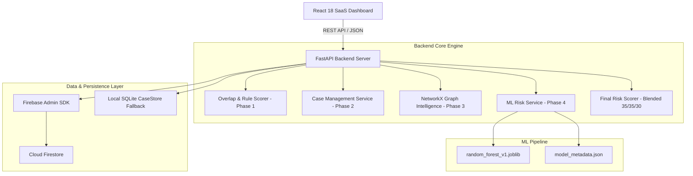

# 🚀 RazorGuard AI — Enterprise Merchant Risk & Collusion Intelligence Platform

**RazorGuard AI** is a defense-only fraud detection, network graph intelligence, Machine Learning risk scoring, and enterprise case management platform built for the **Razorpay AI Buildathon 2026**.

It uncovers complex merchant–customer collusion rings by moving beyond simple transaction-level anomaly checks to **relationship graph topology** and **Machine Learning Risk Intelligence** backed by **Cloud Firestore persistence** and a commercial-grade **Enterprise Investigator Dashboard**.

---

## 1. Problem Statement & Solution

### The Problem
Traditional fraud detection engines analyze transactions in isolation. Modern payment fraud—especially **merchant-customer collusion rings**, **cashout syndicates**, and **refund velocity abuse**—operates across distributed entities. Fraudsters cycle payments through interconnected customer accounts, shared hardware device fingerprints, shared IP addresses, and shared UPI payout destinations to evade rule-based thresholds.

### The RazorGuard AI Solution
RazorGuard AI uncovers multi-entity collusion rings by combining:
1. **Rule-Based Overlap Detection (Phase 1)**: Analyzes refund velocity, transaction volume concentration, and shared hardware/identity signals.
2. **Investigation & Case Management (Phase 2)**: Idempotent case creation, risk score breakdown, and investigator audit logging.
3. **Advanced Fraud Network Intelligence (Phase 3)**: NetworkX identity graph analysis detecting circular payment loops, shared customer clusters, and high-density collusion rings.
4. **ML/AI Risk Intelligence (Phase 4)**: `RandomForestClassifier` predicting 0–100 ML risk scores with explainable feature importance attributes.
5. **Enterprise Investigator Dashboard (Phase 5)**: Commercial-grade React SaaS dashboard featuring global command search (`Cmd/Ctrl+K`), entity workspaces, graph visualizer, case management, alerts, analytics, and system health monitoring.

---

## 2. System Architecture & Component Diagram



---

## 3. Development Progress & Phase Status

| Phase | Description | Status |
| :--- | :--- | :---: |
| **Phase 1** | **Detection Foundation**: Synthetic data generator, overlap detector, transaction risk scorer | ✅ Complete |
| **Phase 2** | **Investigation & Case Management**: Idempotent CaseStore, investigator notes, status updates | ✅ Complete |
| **Phase 3** | **Advanced Fraud Network Intelligence**: NetworkX graph topology, collusion pattern detector | ✅ Complete |
| **Phase 4** | **ML/AI Risk Intelligence**: 22-feature vector, RandomForest model, explainable risk scoring | ✅ Complete |
| **Phase 5** | **Enterprise Investigator Dashboard & SaaS Experience**: Command Center, entity workspaces, SVG graph visualizer, search modal, analytics | ✅ Complete |
| **Phase 6** | **Real-Time Detection & Alerting**: WebSockets, streaming transaction ingestion | 🔮 Planned |

---

## 4. Key Implemented Features

### 🏢 1. Enterprise Command Center (`/dashboard`)
* **KPI Metrics Grid**: Real-time counters for Total Transactions, Critical Cases, Suspicious Merchants, Network Clusters, Active Alerts.
* **Risk Volume Trend Chart**: Interactive time-series line chart (24h, 7d, 30d views) tracking transaction volume vs high-risk collusion events.
* **Risk Level Distribution**: Breakdown across `LOW` (0-29), `MEDIUM` (30-59), `HIGH` (60-79), and `CRITICAL` (80-100).
* **Top Risky Merchants Table**: Ranked list of highest-risk merchants with one-click workspace navigation.
* **Active Investigation Cases**: Feed of active open cases with severity badges.

### 🏪 2. Merchant Investigation Workspace (`/merchants`)
* Searchable directory filtered by risk score and category.
* Dedicated workspace displaying Merchant ID, Category, Registered Device ID, Payout UPI, City, and Status.
* Unified 4-score risk card: **Transaction Risk**, **Network Risk**, **ML Risk**, and **Blended Final Risk Score**.
* Observable risk evidence breakdown and active case associations.

### 👤 3. Customer Investigation Workspace (`/customers`)
* Searchable customer directory with risk filtering.
* Identity fingerprint analysis: Hardware device hash, payment instrument hash, network IP address.
* Customer risk evidence breakdown explaining shared identity indicators across merchants.

### 💳 4. Transaction Risk Workspace (`/transactions`)
* Transaction table showing Transaction ID, Merchant, Customer, Amount, Refund Status, and Transaction Status.
* Transaction inspection modal revealing 4 risk scores, rule signals, and ML feature contributions.

### 🕸️ 5. Network Intelligence Workspace (`/network`)
* **Interactive SVG Graph Visualizer**: Smooth zoom, pan, node selection, edge selection, entity type filter, risk score range slider.
* **Collusion Cluster Breakdown**: Cards detailing cluster density, node count, merchant/customer ratio, and detected patterns (`CIRCULAR_RELATIONSHIP`, `SHARED_DEVICE`, `SHARED_PAYMENT`).
* **Entity Inspector Drawer**: Real-time details on clicked nodes (connections count, risky relationships, direct navigation).
* **Shortest Path Calculator**: Finds network graph connection paths between any 2 entity IDs.

### 📋 6. Case Management Workspace (`/cases`)
* Status tabs: `ALL`, `NEW`, `UNDER_REVIEW`, `CONFIRMED_FRAUD`, `FALSE_POSITIVE`, `CLOSED`.
* Severity filtering and title/merchant search.
* **Investigation Workspace**: Risk evidence timeline, status transition actions (`Confirm Fraud`, `Under Review`, `Dismiss`, `Close`), and investigator notes audit log (`POST /api/cases/{case_id}/notes`).

### 🔔 7. Active Fraud Risk Alerts Feed (`/alerts`)
* Filterable alert feed by severity (`CRITICAL`, `HIGH`, `MEDIUM`).
* Direct actions to open associated cases or investigate merchant accounts.

### 📊 8. Fraud Intelligence Analytics (`/analytics`)
* Detection benchmark metrics: **Accuracy (100%)**, **Precision (100%)**, **Recall (100%)**, **ROC-AUC (1.00)**.
* Quantitative breakdown of ML model parameters and graph collusion topology metrics.

### ⚙️ 9. System Health & Settings (`/settings`)
* Microservice operational status check via `GET /health`.
* Cloud Firestore connectivity status indicator.
* ML model metadata details via `GET /api/ml/model-info`.
* Configurable risk engine weights: **35% Transaction Rule + 35% Network Graph + 30% ML Intelligence**.

### 🔍 10. Global Command Search Modal (`Cmd/Ctrl+K`)
* Command search overlay searching across Merchant IDs (`M089`), Customer IDs (`C002`), Transaction IDs (`TX_...`), and Case IDs (`CASE-0002`).

---

## 5. ML Risk Intelligence & Explainability Architecture (Phase 4)

$$\text{Final Risk Score} = (0.35 \times \text{Transaction Risk}) + (0.35 \times \text{Network Risk}) + (0.30 \times \text{ML Risk})$$

### Extracted Numerical Features (22 Features)
* **Transaction-Level**: `amount`, `tx_frequency`, `merchant_tx_count`, `customer_tx_count`, `pair_tx_count`, `refund_count`, `refund_ratio`, `transaction_risk_score`, `risk_indicators_count`, `burst_count`, `velocity`.
* **Network-Level**: `merchant_degree`, `customer_degree`, `shared_device_count`, `shared_ip_count`, `shared_payment_count`, `network_relationship_count`, `cluster_size`, `cluster_density`, `risky_relationship_count`, `repeated_relationship_count`, `network_risk_score`.

### Model Artifacts & Explainability
* **Model Version**: `1.0.0-rf-synthetic`
* **Algorithm**: `RandomForestClassifier(n_estimators=100, max_depth=10, random_state=42)`
* **Artifacts**: [`backend/app/ml/models/random_forest_v1.joblib`](file:///c:/Users/Pranay%20Project/RazorGuard/backend/app/ml/models/random_forest_v1.joblib) and [`backend/app/ml/models/model_metadata.json`](file:///c:/Users/Pranay%20Project/RazorGuard/backend/app/ml/models/model_metadata.json).
* **Explainability**: Every prediction returns top feature contributions with Gini importance values and human-readable explanation strings (`FEATURE_REASON_TEMPLATES`).

---

## 6. API Endpoints Reference

FastAPI provides full interactive OpenAPI documentation at `http://127.0.0.1:8000/docs`.

| Method | Endpoint | Description |
| :--- | :--- | :--- |
| `GET` | `/health` | Server, Firestore, & ML engine health check |
| `GET` | `/api/search?q={query}` | Global command search across merchants, customers, transactions, and cases |
| `GET` | `/api/dashboard/summary` | Dashboard KPI summary statistics |
| `POST` | `/api/detection/run` | Execute full detection, case creation, and network analysis |
| `GET` | `/api/cases` | List investigation cases (with status & risk filters) |
| `GET` | `/api/cases/{case_id}` | Get detailed case workspace data |
| `POST` | `/api/cases/{case_id}/status` | Update investigation status (`UNDER_REVIEW`, `CONFIRMED_FRAUD`, etc.) |
| `POST` | `/api/cases/{case_id}/notes` | Add investigator note to case audit log |
| `GET` | `/api/network/overview` | Network graph metrics overview |
| `GET` | `/api/network/nodes` | List network graph nodes |
| `GET` | `/api/network/edges` | List network graph edges |
| `GET` | `/api/network/clusters` | List detected collusion clusters |
| `GET` | `/api/network/entity/{id}` | Inspect entity network details |
| `GET` | `/api/network/path/{src}/{tgt}` | Calculate shortest graph path between entities |
| `GET` | `/api/merchants` | List persistent merchants |
| `GET` | `/api/merchants/{id}` | Get merchant detail workspace data |
| `GET` | `/api/customers` | List persistent customers |
| `GET` | `/api/customers/{id}` | Get customer detail workspace data |
| `GET` | `/api/transactions` | List persistent transactions |
| `GET` | `/api/alerts` | List active risk alerts |
| `POST` | `/api/ml/score` | Compute ML risk score & blended final risk score |
| `GET` | `/api/ml/model-info` | Get ML model metadata and features list |

---

## 7. Repository Structure

```text
RazorGuard/
├── backend/
│   ├── app/
│   │   ├── cases/               # Phase 2 CaseStore & CaseService
│   │   ├── data/                # Synthetic data generator (Seed 42)
│   │   ├── detector/            # Phase 1 Overlap & Rule Detector
│   │   ├── ml/                  # Phase 4 ML Risk Intelligence
│   │   │   ├── feature_extractor.py
│   │   │   ├── final_scorer.py
│   │   │   ├── ml_config.py
│   │   │   ├── ml_service.py
│   │   │   └── models/          # joblib & metadata artifacts
│   │   ├── models/              # Pydantic schemas
│   │   ├── network/             # Phase 3 NetworkX Graph Engine
│   │   ├── scoring/             # Risk Scorer & Evaluator
│   │   ├── services/            # Firebase & Firestore Stores
│   │   └── main.py              # FastAPI Application & API Routes
│   ├── scripts/
│   │   ├── train_ml_model.py    # ML Model Training Pipeline
│   │   └── seed_firestore.py    # Firestore Data Seeder
│   ├── tests/                   # 37 Automated pytest Unit Tests
│   │   ├── test_cases.py
│   │   ├── test_detector.py
│   │   ├── test_firebase.py
│   │   ├── test_generator.py
│   │   ├── test_investigation.py
│   │   ├── test_ml.py
│   │   ├── test_network.py
│   │   ├── test_scorer.py
│   │   └── test_search.py
│   └── requirements.txt
├── frontend/
│   ├── src/
│   │   ├── components/          # SaaS Layout, Cards, SearchModal, SVG Graph
│   │   ├── pages/               # 9 Enterprise Investigation Workspaces
│   │   ├── api.js               # REST API Client Bindings
│   │   ├── App.jsx              # Main App Container & URL Query Router
│   │   └── index.css            # Dark Theme CSS Design Tokens
│   ├── package.json
│   └── vite.config.js
└── README.md
```

---

## 8. Environment Setup & Installation

### Environment Variables
Configure environment variables using placeholders (do NOT commit real credentials):

```bash
# Backend Environment Setup (.env)
RAZORGUARD_DB_PATH=generated_data/razorguard.db
FIREBASE_CREDENTIALS_PATH=path/to/your/firebase-service-account.json
```

### 1. Backend Installation & Execution

```bash
# Navigate to backend directory
cd backend

# Install dependencies
pip install -r requirements.txt

# Run ML model training pipeline
python scripts/train_ml_model.py

# Run complete backend test suite (37 tests passing)
python -m pytest tests

# Start FastAPI backend server
uvicorn app.main:app --reload
```

### 2. Frontend Installation & Build

```bash
# Navigate to frontend directory
cd frontend

# Install dependencies
npm install

# Verify production build
npm run build

# Start React development server
npm run dev
```

The frontend will run at `http://localhost:5173` and automatically proxy API calls to the FastAPI backend at `http://127.0.0.1:8000`.

---

## 9. Future Roadmap (Phase 6)

* **Phase 6 — Real-Time Detection & Alerting (Planned)**:
  * WebSockets event bus for live streaming transaction risk analysis.
  * Real-time push notifications for newly formed high-density collusion clusters.
  * Streaming transaction ingestion pipeline.

---

## 10. Defense-Only Notice

> **NOTICE**: RazorGuard AI is strictly a defense-only fraud detection and model evaluation system built for the Razorpay AI Buildathon 2026. All datasets are synthetically generated using reproducible random seeds. The repository contains zero real customer PII, zero real payment credentials, and zero secret keys.
