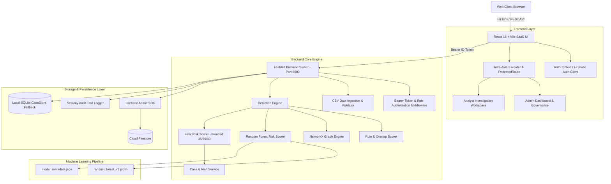

# RazorGuard

### AI-Powered Merchant-Customer Collusion & Payment Fraud Intelligence Platform

RazorGuard is an enterprise fraud detection, relationship network intelligence, machine learning risk scoring, and case management platform designed to identify coordinated payment fraud rings and merchant-customer collusion syndicates.

By moving beyond single-transaction checks to multi-entity relationship graph topology and explainable machine learning predictions, RazorGuard uncovers distributed fraud networks, shared identity indicators, and structured refund velocity abuse.


---

## 🎥 Pitch Video & Links

- **Pitch Video**: Coming soon / Not currently deployed
- **Live Demo**: Not currently deployed
- **GitHub Repository**: [RazorGuard AI Repository](https://github.com/pranaykhodade1922-dot/RazorGuard-AI-Merchant-Customer-Collusion-Detector)
- **Interactive API Documentation**: `http://127.0.0.1:8000/docs` (when backend is running)

---

## The Problem

Traditional payment fraud engines inspect transactions in isolation. Modern organized fraud syndicates—especially **merchant-customer collusion rings**, **cashout syndicates**, and **systematic refund velocity abuse**—exploit this single-entity monitoring model:

1. **Distributed Collusion Rings**: High-value illicit payouts are split across multiple customer accounts linked to complicit merchant storefronts.
2. **Identity Obfuscation**: Fraudsters cycle payments across shared physical hardware device fingerprints, IP subnets, and UPI handles to stay under individual account risk limits.
3. **Structured Threshold Avoidance**: Transaction values are kept intentionally low while accumulating high refund rates and rapid payment loops.
4. **Manual Investigation Bottlenecks**: Risk teams struggle to identify multi-entity relationships using static spreadsheets, leading to delayed action and high fraud exposure.

---

## The Solution

RazorGuard transforms raw payment and transaction records into structured, actionable fraud intelligence through a multi-layered evaluation pipeline:

```text
       Raw Transaction & Entity Datasets
                     │
                     ▼
           Data Ingestion Pipeline
        (CSV Import / Schema Validator)
                     │
                     ▼
            Core Detection Engine
     ┌───────────────┼───────────────┐
     ▼               ▼               ▼
Rule & Overlap   Network Graph   ML Scorer
   Scorer        Topology Engine (22 Features)
     │               │               │
     └───────────────┼───────────────┘
                     ▼
         Blended Final Risk Score
  (35% Rule + 35% Graph + 30% ML Score)
                     │
                     ▼
         Risk Prioritization Engine
                     │
          ┌──────────┴──────────┐
          ▼                     ▼
   Priority Alerts      Investigation Cases
          │                     │
          └──────────┬──────────┘
                     ▼
      Role-Differentiated SaaS Workspaces
         (ADMIN / ANALYST Navigation)
```

---

## Core Capabilities

### 🔍 Fraud Intelligence
- **Blended Risk Model**: Combines transaction overlap signals (35%), graph topology metrics (35%), and Random Forest ML predictions (30%) into a unified 0–100 risk score.
- **Explainable Predictions**: Displays exact feature contributions, Gini importance values, and human-readable reasoning for every score prediction.
- **Risk Categorization**: Automatically groups entities into `LOW` (0–29), `MEDIUM` (30–59), `HIGH` (60–79), and `CRITICAL` (80–100) risk levels.

### 🕸️ Relationship Intelligence
- **Multi-Graph Entity Mapping**: Connects Merchants, Customers, Devices, IP Subnets, and UPI Payout Handles into an entity graph.
- **Collusion Pattern Detection**: Identifies circular payment loops, shared device fingerprints, shared IP addresses, and dense collusion clusters.
- **Interactive SVG Graph Visualizer**: Features smooth pan, zoom, node/edge selection, risk score filters, entity drawers, and shortest path calculation between entities.

### 📋 Investigation & Case Management
- **Automated Case Workflow**: Automatically generates investigation cases for high-risk entities.
- **Case Lifecycle Controls**: Manages case status transitions (`NEW`, `UNDER_REVIEW`, `CONFIRMED_FRAUD`, `FALSE_POSITIVE`, `CLOSED`).
- **Investigator Audit Trail**: Records timed investigator notes, actions, and decision history.
- **Priority Threat Alerts**: Real-time alert feed filtered by threat severity (`CRITICAL`, `HIGH`, `MEDIUM`).

### 📥 Data Intelligence
- **Multi-Dataset Ingestion**: Batch CSV ingestion supporting `Transactions`, `Merchants`, and `Customers`.
- **Validation & Normalization**: Performs header verification, missing value checks, invalid data type filtering, and duplicate ID detection prior to analysis.

### 🛡️ Security & Access Control
- **Firebase Authentication**: Supports email/password authentication and Google Sign-In with persistent session state.
- **Role-Based Access Control (RBAC)**: Tailors UI workspaces and restricts sensitive API operations between `ADMIN` and `ANALYST` roles.
- **Server-Side Token Verification**: Validates Firebase Bearer ID tokens on backend routes with `require_admin` dependency checks.
- **Security Audit Stream**: Real-time logging of authentication events, dataset imports, case modifications, and administrative operations.

---

## Role-Based Intelligence

RazorGuard provides distinct interfaces engineered for administrative governance vs. threat investigation:

```text
                            Authenticated User
                                    │
                                    ▼
                        Firebase Identity Verification
                                    │
           ┌────────────────────────┴────────────────────────┐
           ▼                                                 ▼
      ADMIN Role                                       ANALYST Role
Platform & Operational Oversight                   Fraud Investigation & Threat Intelligence
           │                                                 │
 ├── System Health & Metrics Overview                ├── Investigation Workspace & Workload
 ├── Data Ingestion Pipeline (`/ingest`)              ├── Open Investigation Cases Queue (`/cases`)
 ├── Security Audit Trail Stream (`/audit`)          ├── Priority Threat Alerts (`/alerts`)
 └── System Configuration (`/settings`)              ├── Transaction Inspection Log (`/transactions`)
                                                     ├── Merchant & Customer Risk Directories
                                                     └── Interactive Network Graph (`/network`)
```

### 🔐 Admin (Platform & Operational Oversight)
- **Platform Overview**: System-wide volume tracking, active merchant/customer directories, total cases, and global fraud exposure ($).
- **Data Upload Pipeline**: Batch CSV ingestion (`/ingest`) for feeding new entity and transaction datasets into the analysis engine.
- **Security Audit Logs**: Live audit stream (`/audit`) recording user sessions, CSV imports, case state updates, and administrative events.
- **System Settings**: System health monitoring and access control configurations (`/settings`).

### 🕵️ Analyst (Fraud Investigation Workspace)
- **Investigation Workspace**: Action-oriented dashboard highlighting active high-risk queues, priority alerts, and suspicious merchant hotspots.
- **Case Lifecycle Management**: Full case workspace (`/cases`), status transitions (`CONFIRMED_FRAUD`, `UNDER_REVIEW`, `CLOSED`), and investigator notes.
- **Threat Intelligence**: Access to entity investigation workspaces (`/merchants`, `/customers`, `/transactions`) and network visualizer (`/network`).
- **Role Protection**: Administrative controls (`/ingest`, `/audit`, `/settings`) are restricted via client-side `<ProtectedRoute>` and backend `require_admin` authorization.

---

## How RazorGuard Works

1. **Ingest** — Ingest merchant, customer, and transaction datasets via the CSV data pipeline or API.
2. **Validate** — Automatically validate headers, data types, required fields, and duplicate IDs.
3. **Analyze** — Evaluate transaction velocities, refund ratios, burst patterns, and shared identity signals (device hashes, IP subnets, payment handles).
4. **Connect** — Build NetworkX graph topologies to identify node degrees, cluster densities, and circular payment rings.
5. **Predict** — Run 22 extracted features through the trained Random Forest model (`1.0.0-rf-synthetic`) to generate ML risk scores with explainable feature importance.
6. **Prioritize** — Compute the blended 0–100 risk score and automatically generate priority threat alerts and investigation cases.
7. **Investigate** — Risk analysts review cases, inspect relationship graphs, record findings, and update case statuses.

---

## Illustrative Collusion Detection Example

```text
                       [ Merchant M001 ]
                 (Blended Score: 87.5 / CRITICAL)
                              │
         ┌────────────────────┼────────────────────┐
         │                    │                    │
         ▼                    ▼                    ▼
  [ Customer C001 ]    [ Customer C002 ]    [ Customer C003 ]
         │                    │                    │
         └────────────────────┼────────────────────┘
                              │
                              ▼
                Shared Device ID: DEV_77129
                Shared IP Address: 192.168.1.45
                              │
                              ▼
                  Coordinated Refund Abuse
                 (Refund Ratio: 85% > 30%)
                              │
                              ▼
                 Collusion Pattern Flagged:
            SHARED_DEVICE + HIGH_REFUND_CONCENTRATION
                              │
                              ▼
            Auto-Generated Case: CASE-0001 (CRITICAL)
```

---

## System Architecture



---

## Technology Stack

| Layer | Technology | Purpose |
| :--- | :--- | :--- |
| **Frontend Framework** | React 18 + Vite 5 | Fast, component-driven single page application |
| **Styling & UI** | Vanilla CSS Tokens + Lucide Icons | Dark-themed, enterprise SaaS design system |
| **Backend Framework** | Python 3.12 + FastAPI | Asynchronous REST API server with automatic OpenAPI documentation |
| **Graph Analytics** | NetworkX | Multi-entity topology analysis and cluster density computation |
| **Machine Learning** | Scikit-Learn + Joblib | RandomForest Classifier (22 features) with Gini feature explainability |
| **Authentication** | Firebase Authentication | Email/password & Google Sign-In with Bearer ID token verification |
| **Primary Database** | Cloud Firestore | Cloud NoSQL document store for cases, alerts, and entities |
| **Fallback Database** | SQLite | Automatic local fallback when Cloud Firestore credentials are unmounted |
| **Testing Framework** | Pytest (45 Unit & Integration Tests) | Automated API, detection engine, ML, and ingestion test coverage |
| **Frontend Build** | Vite Production Build (`dist/`) | Bundled web application distribution |

---

## Project Structure

```text
RazorGuard/
├── backend/
│   ├── app/
│   │   ├── cases/               # CaseStore, CaseService, and status models
│   │   ├── data/                # Baseline synthetic data generator
│   │   ├── detector/            # Overlap & rule indicator detector logic
│   │   ├── ml/                  # Machine Learning Risk Intelligence
│   │   │   ├── feature_extractor.py   # 22-feature vector extraction
│   │   │   ├── final_scorer.py       # Blended 35/35/30 risk scoring formula
│   │   │   ├── ml_config.py          # Feature definitions & thresholds
│   │   │   ├── ml_service.py         # Model loading & explainable inference
│   │   │   └── models/               # Model artifact (.joblib) & metadata (.json)
│   │   ├── models/              # Pydantic schemas
│   │   ├── network/             # NetworkX Graph Engine
│   │   ├── scoring/             # Risk Scorer & Evaluator
│   │   ├── services/            # Firebase, Firestore, & CSV Ingestion Services
│   │   └── main.py              # FastAPI Application, middleware, and API endpoints
│   ├── scripts/
│   │   ├── train_ml_model.py    # Model training pipeline script
│   │   └── seed_firestore.py    # Cloud Firestore database seeder
│   ├── tests/                   # 11 Automated Test Suites (45 Unit & Integration tests)
│   ├── sample_data/             # Sample CSV datasets
│   └── requirements.txt
├── frontend/
│   ├── src/
│   │   ├── components/          # Sidebar, Navbar, ProtectedRoute, SVG Graph Visualizer
│   │   ├── pages/               # Enterprise Workspaces (Dashboard, Cases, Alerts, Ingest, Audit, etc.)
│   │   ├── api.js               # REST API Client Bindings & Bearer Auth handling
│   │   ├── App.jsx              # Main App Container, Role Router, AuthProvider
│   │   └── index.css            # Dark Theme CSS Design System
│   ├── package.json
│   ├── vite.config.js
│   ├── .env.example             # Environment variable documentation template
│   └── .env.local               # Local environment configuration file (git-ignored)
└── README.md
```

---

## Data Ingestion Format

Datasets can be uploaded via the UI at `/ingest` (Admin role) or directly via `POST /api/ingest/csv`.

### 1. Transactions CSV (`transactions.csv`)
- **Required Headers**: `transaction_id`, `merchant_id`, `customer_id`, `amount`
- **Optional Headers**: `timestamp`, `payment_status`, `refund_status`, `device_id`, `ip_address`, `customer_upi`

*Example:*
```csv
transaction_id,merchant_id,customer_id,amount,payment_status,refund_status,device_id,ip_address
TX_1001,M001,C001,4500.00,COMPLETED,NONE,DEV_991,192.168.1.10
TX_1002,M001,C002,4800.00,COMPLETED,REFUNDED,DEV_991,192.168.1.10
```

### 2. Merchants CSV (`merchants.csv`)
- **Required Headers**: `merchant_id`, `merchant_name`
- **Optional Headers**: `category`, `payout_upi`, `payout_bank_account`, `registered_device_id`, `registered_ip`, `city`

*Example:*
```csv
merchant_id,merchant_name,category,payout_upi,city
M001,Nexus Tech Electronics,ELECTRONICS,nexus@upi,Mumbai
M002,Apex Retailers,RETAIL,apex@upi,Delhi
```

### 3. Customers CSV (`customers.csv`)
- **Required Headers**: `customer_id`, `customer_name`
- **Optional Headers**: `upi_id`, `device_id`, `ip_address`, `city`

*Example:*
```csv
customer_id,customer_name,upi_id,device_id,ip_address,city
C001,Rahul Sharma,rahul@upi,DEV_991,192.168.1.10,Mumbai
C002,Priya Patel,priya@upi,DEV_991,192.168.1.10,Mumbai
```

---

## API Reference

| Method | Endpoint | Description | Auth Requirement |
| :--- | :--- | :--- | :--- |
| `GET` | `/health` | Server, Firestore, & ML engine health check | None |
| `POST` | `/api/auth/register` | Register new user account | None |
| `POST` | `/api/auth/login` | Authenticate user & retrieve session context | None |
| `GET` | `/api/auth/me` | Fetch authenticated user profile & role | Bearer Token |
| `POST` | `/api/ingest/csv` | Import CSV dataset & execute collusion detection | Bearer Token (**Admin Only**) |
| `GET` | `/api/audit-logs` | Retrieve security & operational audit logs | Bearer Token (**Admin Only**) |
| `GET` | `/api/search?q={query}` | Global command search across merchants, customers, transactions, & cases | Bearer Token |
| `GET` | `/api/dashboard/summary` | Retrieve dashboard KPI summary metrics | Bearer Token |
| `POST` | `/api/detection/run` | Execute collusion detection & case generation engine | Bearer Token |
| `GET` | `/api/cases` | List investigation cases (with status & risk filters) | Bearer Token |
| `GET` | `/api/cases/{case_id}` | Retrieve detailed case workspace details | Bearer Token |
| `POST` | `/api/cases/{case_id}/status` | Update case status (`UNDER_REVIEW`, `CONFIRMED_FRAUD`, etc.) | Bearer Token |
| `POST` | `/api/cases/{case_id}/notes` | Append investigator note to case audit trail | Bearer Token |
| `GET` | `/api/network/overview` | Network graph metrics summary | Bearer Token |
| `GET` | `/api/network/nodes` | List graph nodes (Merchants, Customers, Devices, IPs) | Bearer Token |
| `GET` | `/api/network/edges` | List graph edges (Transactions, Shared Device, Shared IP) | Bearer Token |
| `GET` | `/api/network/clusters` | List detected collusion graph clusters | Bearer Token |
| `GET` | `/api/network/entity/{id}` | Inspect detailed entity network connections | Bearer Token |
| `GET` | `/api/network/path/{src}/{tgt}`| Compute shortest graph path between two entities | Bearer Token |
| `GET` | `/api/merchants` | List merchants with risk scores | Bearer Token |
| `GET` | `/api/merchants/{id}` | Get detailed merchant workspace data | Bearer Token |
| `GET` | `/api/customers` | List customers with identity fingerprints | Bearer Token |
| `GET` | `/api/customers/{id}` | Get detailed customer workspace data | Bearer Token |
| `GET` | `/api/transactions` | List transactions with risk indicators | Bearer Token |
| `GET` | `/api/alerts` | List active risk alerts filtered by severity | Bearer Token |
| `POST` | `/api/ml/score` | Compute ML score & blended final risk score | Bearer Token |
| `GET` | `/api/ml/model-info` | Get ML model version, parameters, & feature list | Bearer Token |

---

## Authentication & Access Control

RazorGuard leverages Firebase Authentication for robust user verification:
- **Sign-In Options**: Supports email/password authentication and Google Sign-In.
- **Identity Integrity**: User profile display names, emails, and profile pictures (`photoURL`) are populated directly from verified Firebase credentials.
- **Session Management**: Session state is persisted across page reloads with automatic token refresh.
- **Role Authorization**: Authorization claims govern access between `ADMIN` and `ANALYST` roles.

---

## Security Architecture

- **Verified ID Tokens**: FastAPI `get_current_user` middleware validates Firebase Bearer tokens on protected API endpoints.
- **Server-Side RBAC**: Sensitive backend routes (`POST /api/ingest/csv`, `GET /api/audit-logs`) use `require_admin` dependency checks.
- **Client Route Guarding**: `<ProtectedRoute>` prevents unauthorized navigation to administrative views.
- **Rate Limiting**: Sliding window rate limiting guards sensitive endpoints against automated brute-force requests.
- **CORS Isolation**: Configured allowed origins (`ALLOWED_ORIGINS`) isolate API traffic.
- **Audit Logging**: `SecurityAuditLogger` records user sign-ins, data imports, case updates, and administrative actions.

> [!NOTE]
> RazorGuard is an intelligence prototype designed for evaluation. Production deployment requires formal penetration testing, security auditing, and monitoring setup.

---

## Getting Started

### Prerequisites

- **Python**: `3.10` or higher
- **Node.js**: `18.0.0` or higher
- **npm**: `9.0.0` or higher

### Environment Setup

1. **Backend Environment (`backend/.env`)**:
   ```env
   ENABLE_AUTH=true
   ALLOWED_ORIGINS=http://localhost:3000,http://127.0.0.1:3000
   RAZORGUARD_DB_PATH=generated_data/razorguard.db
   FIREBASE_CREDENTIALS_PATH=path/to/firebase-service-account.json
   ```

2. **Frontend Environment (`frontend/.env.local`)**:
   ```env
   VITE_FIREBASE_API_KEY=your_firebase_web_api_key
   VITE_FIREBASE_AUTH_DOMAIN=your_project.firebaseapp.com
   VITE_FIREBASE_PROJECT_ID=your_project_id
   VITE_FIREBASE_STORAGE_BUCKET=your_project.appspot.com
   VITE_FIREBASE_MESSAGING_SENDER_ID=your_sender_id
   VITE_FIREBASE_APP_ID=your_app_id
   ```

> [!WARNING]
> Never commit private keys, service account JSON credentials, or `.env.local` files to Git.

### Installation & Execution

1. **Start Backend Server**:
   ```bash
   cd backend
   pip install -r requirements.txt

   # Optional: Run interactive CLI demo
   python run_demo.py

   # Start production REST API server
   python -m uvicorn app.main:app --reload --host 127.0.0.1 --port 8000
   ```
   Backend API runs at `http://127.0.0.1:8000` with interactive docs at `http://127.0.0.1:8000/docs`.

2. **Start Frontend Server**:
   ```bash
   cd frontend
   npm install
   npm run dev
   ```
   Frontend server runs at `http://localhost:3000`.

---

## Testing & Verification

### Automated Backend Tests
Run the complete backend test suite:

```bash
cd backend
python -m pytest tests/
```
```text
======================= 45 passed, 2 warnings in 15.62s =======================
```
- **Result**: `100% Pass` (45/45 tests passing).

### Production Frontend Build
Verify that the production bundle compiles cleanly:

```bash
cd frontend
npm run build
```
```text
✓ built in 2.76s
dist/index.html                   0.81 kB
dist/assets/index-BrLUpLT6.css    4.26 kB
dist/assets/index-C3PG_MJo.js   489.30 kB
```
- **Result**: `0 errors`.

---

## Product Screenshots

*Product screenshots will be added before final submission.*

---

## Product Walkthrough

### Analyst Walkthrough (Fraud Investigation)
1. **Sign In**: Log in using an Analyst account or Google Sign-In.
2. **Review Workload**: Inspect active high-risk queues, priority alerts, and suspicious merchant hotspots on the Investigation Workspace.
3. **Analyze Alert**: Navigate to **Priority Alerts** (`/alerts`) and inspect a `CRITICAL` alert.
4. **Investigate Merchant**: Click **Investigate Merchant** to view the merchant risk profile, blended score breakdown (Rule 35%, Graph 35%, ML 30%), and risk indicators.
5. **Explore Network Graph**: Open **Network Graph** (`/network`) to inspect shared device fingerprints, IP subnets, and connected customer nodes.
6. **Update Case**: Open **Cases** (`/cases`), update case status (`UNDER_REVIEW` or `CONFIRMED_FRAUD`), and append investigator findings to the audit log.

### Admin Walkthrough (Operational Oversight)
1. **Sign In**: Log in using an Admin account.
2. **Platform Overview**: View global platform volume, merchant/customer counts, system cases, and global fraud exposure.
3. **Ingest Dataset**: Open **CSV Data Upload** (`/ingest`), select `transactions.csv`, validate schema headers, and trigger collusion detection.
4. **Review Security Stream**: Open **Audit Trail Logs** (`/audit`) to review real-time security events and data operations.

---

## Why RazorGuard?

- **Multi-Entity Graph Intelligence**: Moves beyond single-transaction checks to uncover multi-entity collusion rings.
- **Blended Risk Model**: Combines rule indicators, graph topology, and machine learning into an actionable 0–100 risk score.
- **Role-Differentiated UX**: Tailored interfaces ensure administrators maintain operational control while risk analysts focus on fraud investigation.
- **Explainable AI**: Delivers transparent feature importance breakdowns and reasoning for every score prediction.

---

## Limitations

- **Prototype Scale**: Optimization focused on sample and batch dataset evaluation pipelines.
- **Baseline Data**: Includes reproducible synthetic sample datasets for evaluation.
- **Production Hardening**: Live payment gateway deployments require additional penetration testing and SIEM integration.

---

## Roadmap

- **Streaming Transaction Processing**: Real-time WebSocket event bus for live streaming transaction risk analysis.
- **Graph Neural Networks (GNN)**: Advanced graph neural network models (e.g. GraphSAGE) for automated collusion subgraph classification.
- **Automated AI Case Summaries**: LLM-driven generation of natural language investigation reports.

---

## Acknowledgements

- **FastAPI**: Asynchronous Python web framework.
- **NetworkX**: Network graph topology analysis library.
- **Scikit-Learn**: Machine learning library.
- **Firebase**: Authentication and Cloud Firestore storage.
- **React & Vite**: Frontend web application engine.

---

## Built For

Built as an AI-powered merchant-customer collusion and payment fraud intelligence platform for the **Razorpay AI Buildathon 2026**.
